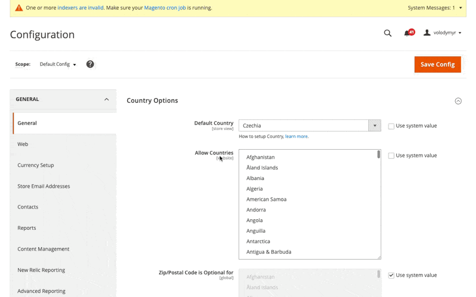

# Magento 2 Smart Cache Cleaner

This module improves Magento 2's cache management by adding intelligent cache cleaning functionality.

## Features

- **Targeted Cache Cleaning**: Flush only invalidated cache types instead of clearing all cache types
- **One-Click Cache Refresh**: Clean invalidated caches directly from system messages
- **AJAX-Based Implementation**: Clean caches without page reload
- **User-Friendly Confirmations**: Confirmation dialogs to prevent accidental cache cleaning

## Requirements

- Magento 2.4.4 or higher
- PHP 8.1 or higher

## Installation

### Composer (recommended)

```bash
composer require hryvinskyi/magento2-smart-cache-cleaner
php bin/magento setup:upgrade
php bin/magento setup:di:compile
php bin/magento setup:static-content:deploy
```

### Manual Installation

1. Download the module and upload it to `app/code/Hryvinskyi/SmartCacheCleaner`
2. Run the following commands:
```bash
php bin/magento setup:upgrade
php bin/magento setup:di:compile
php bin/magento setup:static-content:deploy
```

## Usage

### Admin Cache Management

1. Go to **System > Cache Management**
2. Use the new **Flush Invalidated Cache** button to clean only invalidated cache types

### From System Messages

When cache invalidation messages appear:
1. Click the **Click Here** link in the notification message
2. Confirm the action in the popup dialog
3. The invalidated caches will be refreshed via AJAX without reloading the page

## Screenshots



## Support

For issues, questions or contributions, please contact the author or create an issue in the GitHub repository.

## Author

- **Volodymyr Hryvinskyi**
- Email: volodymyr@hryvinskyi.com
- GitHub: https://github.com/hryvinskyi

## License

This project is licensed under the MIT License.